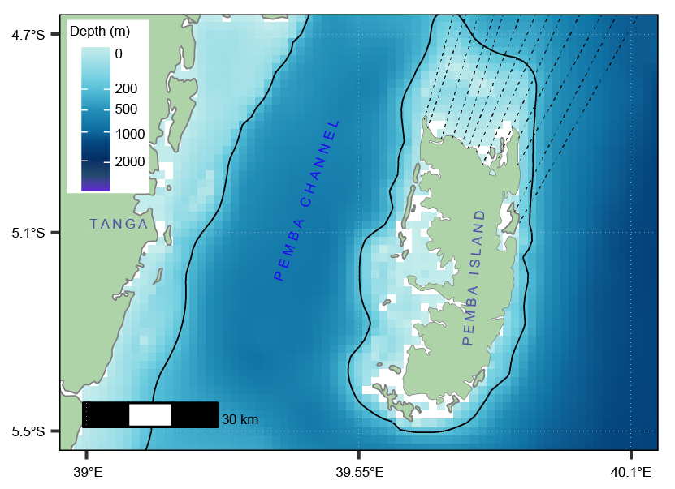

# Introduction

Some areas in the ocean may experience high levels of nutrients but have low phytoplankton biomass. These areas are referred to as High-Nutrient, Low-Chlorophyll (HNLC) area. The HNLC area is a region of the ocean where major nutrients needed for photosynthesis specifically nitrate, phosphate, and silicic acid are abundant in the surface waters, yet the concentration of chlorophyll-*a* (Chl-*a*) and phytoplankton in general is surprisingly low [@martin1990].

Phytoplankton are the base of the marine food web and produce a huge portion of the oxygen on the Earth during photosynthesis process [@falkowski1998]. We can measure their presence by assessing the concentration of Chl-*a*, the green pigment used in photosynthesis. Normally, where the concentration of nutrient is high, we expect to see a high Chl-*a* concentration which is an indication of higher phytoplankton productivity. In HNLC regions, the situation is quite different.

In this article, we will assess the existence of such situation in the Northern and Eastern coast of the Pemba Island, off the coast of Tanzania [@fig-map].

First we will load the packages that will be used in this article. These are `tidyverse` [@tidyverse19], `sf` [@sf18] and `patchwork` [@patchwork24]. We will also use `metR` [@metR21] for creating the contour plots and `oce` [@oce24] for the color palette.

```{r}
#| warning: false
#| message: false
#| echo: false
#| 
require(tidyverse)
require(sf)
require(patchwork)
require(metR)
require(oce)
require(tidyterra)
require(terra)
```

# Data

We will use Pemba dataset of December 2024, extracted using **geodata** package [@geodata24]. The dataset consists of six variables: Longitude, Latitude, Chlorophyll, Nitrate, Phosphate and Iron.


```{r}
#| warning: false
#| message: false
#| comment: ""
#| echo: false
#| include: false
#| 
pemba.data = read_csv("pemba_geodata.csv")

tz = st_read("tz_kenya.gpkg")

bath_tz = rast("Tanzania_etopo1/tanz1_-3432.asc") |> 
  crop(ext(c(38,42, -11,-4))) |> 
  rename(depth = 1)

bath_tz[bath_tz > 0] = NA # setting land area to NA value
```

```{r}
#| eval: false
#| include: false
#| 
ggplot() +
  geom_spatraster(data = bath_tz) +
  geom_spatraster_contour(data = bath_tz, breaks = c(-200), color = "black") +
  ggspatial::layer_spatial(data = tz, fill = "#aed3a9", color = "grey50") +
  coord_sf(xlim = c(39,40.1),
           ylim = c(-5.5,-4.7)) +
  scale_x_continuous(breaks = seq(39, 40.1, length.out = 3) |> round(2),
                     labels = metR::LonLabel(seq(39, 40.1, length.out = 3) |> round(2))) +
  scale_y_continuous(breaks = seq(-5.5, -4.7, length.out = 3) |> round(2),
                     labels = metR::LatLabel(seq(-5.5, -4.7, length.out = 3) |> round(2))) +
  scale_fill_gradientn(name = "Depth (m)",
                       colours = c("#5e24d6","#22496d","#042f66","#054780","#1074a6",
                                "#218eb7","#48b5d2","#72d0e1","#9ddee7","#c6edec"),
                       breaks=c(0,-200,-500,-1000,-2000,-4000),
                       labels=c(0,200,500,1000,2000,4000),
                       trans = scales::modulus_trans(p = 0.4),
                       na.value = NA) +
  ggspatial::annotation_north_arrow(location = "tr", width = unit(0.7, "cm"), height = unit(0.7, "cm")) +
  ggspatial::annotation_scale(location = "bl") +
  theme_bw(base_size = 10) +
  theme(
    panel.background = element_blank(),
    panel.grid.major = element_line(linetype = "dotted",colour = "grey80", linewidth = 0.15),
    panel.ontop = TRUE,
    panel.grid.minor = element_blank(),
    panel.border = element_rect(colour = "black", linewidth = 0.3),
    axis.title = element_blank(), 
    axis.text = element_text(colour = "black", size = 10),
    legend.title = element_text(size = 10),
    legend.text = element_text(size = 9),
    legend.background = element_rect(colour = "black", linewidth = .3),
    legend.position = c(0.08,.79)
  )

# ggsave("map.pdf", width = 3, height = 3, dpi = 600)
```

{#fig-map width="50%"}


# Concentration of Nitrate and Phosphate

Both nitrate and phosphate concentration shows nearly similar pattern that, the Northern and Eastern side of the Pemba Island have higher nutrient concentration than at the Channel [@fig-nitrate-phos]. The availability of these higher nutrient levels might be an indication of productive water around the area.

```{r, fig.width=7, fig.height=6}
#| label: fig-nitrate-phos
#| fig-cap: The concentration of nitrate and phosphate along the Pemba Island
#| warning: false
#| message: false
#| fig-width: 7
#| fig-height: 6
#| comment: ""
#| echo: false
#| 

no3.fig = pemba.data |> 
  ggplot() +
  metR::geom_contour_fill(aes(x = lon, 
                              y = lat,
                              z = nitrate),
                          na.fill = T,
                          bins = 40) +
  geom_sf(data = tz, 
          col = "black", 
          size = 0.25, 
          fill = "grey70") +
  coord_sf(xlim = c(38.9, 39.95), 
           ylim = c(-5.62, -4.63), 
           expand = FALSE) +
  scale_fill_gradientn(name = "NO3", colours = oce::oceColorsViridis(120))+
  scale_x_continuous(breaks = seq(38.9,39.95,0.4))+
  scale_y_continuous(breaks = seq(-5.6,-4.8,0.4)) +
  theme_bw()+
  theme(legend.position = c(0.1,0.75),
        axis.title.y = element_blank(),
        # axis.text.y = element_blank(),
        # axis.ticks.y = element_blank(),
        axis.title.x = element_blank(),
        legend.text = element_text(size = 7, colour = "black"),
        legend.title = element_text(size = 8, colour = "black"),
        legend.key.size = unit(0.3, "cm"))

po4.fig = pemba.data |> 
  ggplot() +
  metR::geom_contour_fill(aes(x = lon, 
                              y = lat,
                              z = phosphate),
                          na.fill = T,
                          bins = 40) +
  geom_sf(data = tz, 
          col = "black", 
          size = 0.25, 
          fill = "grey70") +
  coord_sf(xlim = c(38.9, 39.95), 
           ylim = c(-5.62, -4.63), 
           expand = FALSE) +
  scale_fill_gradientn(name = "PO4", colours = oce::oceColorsViridis(120))+  
  scale_x_continuous(breaks = seq(38.9,39.95,0.4))+
  theme_bw()+
  theme(legend.position = c(0.1,0.75),
        axis.title.y = element_blank(),
        axis.text.y = element_blank(),
        axis.ticks.y = element_blank(),
        axis.title.x = element_blank(),
        legend.text = element_text(size = 7, colour = "black"),
        legend.title = element_text(size = 8, colour = "black"),
        legend.key.size = unit(0.3, "cm"))


no3.fig+po4.fig
# ggsave("nit_phos.png", dpi = 300, width = 7, height = 6)
  
```


```{r, fig.width=7, fig.height=4}
#| message: false
#| warning: false
#| echo: false
#| 
chl.fig = pemba.data |> 
  ggplot() +
  metR::geom_contour_fill(aes(x = lon, 
                              y = lat,
                              z = chl),
                          na.fill = T,
                          bins = 40) +
  geom_sf(data = tz, 
          col = "black", 
          size = 0.25, 
          fill = "grey80") +
  coord_sf(xlim = c(38.9, 39.95), 
           ylim = c(-5.62, -4.63), 
           expand = FALSE) +
  scale_fill_gradientn(name = "Chl-a", colours = oce::oceColorsViridis(120))+
  scale_x_continuous(breaks = seq(38.9,39.95,0.5))+
  scale_y_continuous(breaks = seq(-5.6,-4.8,0.4)) +
  theme_bw()+
  theme(legend.position = c(0.1,0.75),
        legend.text = element_text(size = 7, colour = "black"),
        legend.title = element_text(size = 8, colour = "black"),
        legend.key.size = unit(0.3, "cm"),
        axis.title = element_blank())
  


iron.fig = pemba.data |> 
  ggplot() +
  metR::geom_contour_fill(aes(x = lon, 
                              y = lat,
                              z = iron),
                          na.fill = T,
                          bins = 40) +
  geom_sf(data = tz, 
          col = "black", 
          size = 0.25, 
          fill = "grey70") +
  coord_sf(xlim = c(38.9, 39.95), 
           ylim = c(-5.62, -4.63), 
           expand = FALSE) +
  scale_fill_gradientn(name = "Fe", colours = oce::oceColorsViridis(120))+
  scale_x_continuous(breaks = seq(38.9,39.95,0.4))+
  scale_y_continuous(breaks = seq(-5.6,-4.8,0.4)) +
  theme_bw()+
  theme(legend.position = c(0.1,0.75),
        axis.title.y = element_blank(),
        # axis.text.y = element_blank(),
        axis.ticks.y = element_blank(),
        axis.title.x = element_blank(),
        legend.text = element_text(size = 7, colour = "black"),
        legend.title = element_text(size = 8, colour = "black"),
        legend.key.size = unit(0.3, "cm"))
  
```


# Chlorophyll-a concentration

The concentration of chlorophyll-a in an area was also assessed. However, the result was different from the expected. Although the channel showed lower nutrient concentration than other areas around the Island, the levels of chlorophyll-a was higher in the channel and especially in the Tanga coast than at the Northern and Eastern side of the Island which had higher levels of nutrients [@fig-chl]. Nitrate, phosphate, Chlorophyll-a, light and carbondioxide are the necessary requirements for photosynthesis by phytoplankton. Surprisingly, all of these requirements are available for photosynthesis and still the levels of chl-a is low. What could be the major reason for this discrepancy in the Northern and Eastern Pemba area?

```{r, fig.width=5, fig.height=4}
#| label: fig-chl
#| fig-cap: The concentration of chlorophyll-a along the Pemba Island
#| message: false
#| warning: false
#| echo: false
#| fig-width: 5
#| fig-height: 4
#| 

chl.fig
  
```

# Iron levels

Further investigations was done by assessing the level of Iron in an area. The results indicated lower Iron levels in the Northern and Eastern side of the Island than in the channel [@fig-iron]. The Northern and Eastern areas side of the Island which had higher nitrate and phosphate levels with low chl-a concentration observed to have low Iron levels than areas around the channel. 


```{r, fig.width=5, fig.height=4}
#| label: fig-iron
#| fig-cap: The concentration of Iron along the Pemba Island
#| message: false
#| warning: false
#| echo: false
#| fig-width: 5
#| fig-height: 4
#| 

iron.fig

```

Studies shows that, Iron is the critical micronutrient in phytoplankton. Iron is essential for many metabolic processes in phytoplankton, including photosynthesis and nitrogen fixation [@falkowski1998]. While it is only needed in tiny amounts, its scarcity can act as a bottleneck, preventing phytoplankton from using the plentiful major nutrients to grow and multiply [@boyd2010; @jickells2005]. In the Northern and Eastern side of the Pemba, lower chl-a concentration might be due to lower levels of iron as this is the most critical limiting nutrient in the ocean. This make the northern and eastern side of the Pemba as HNLC area.


```{r, fig.width=5, fig.height=6}
#| warning: false
#| message: false
#| echo: false
#| eval: false
#| 
(no3.fig+po4.fig)/(iron.fig+chl.fig)

no3.fig+iron.fig+chl.fig
# ggsave("nutrient_chl_iron.pdf", dpi = 300, width = 5, height = 3)
```


## Consultated references

